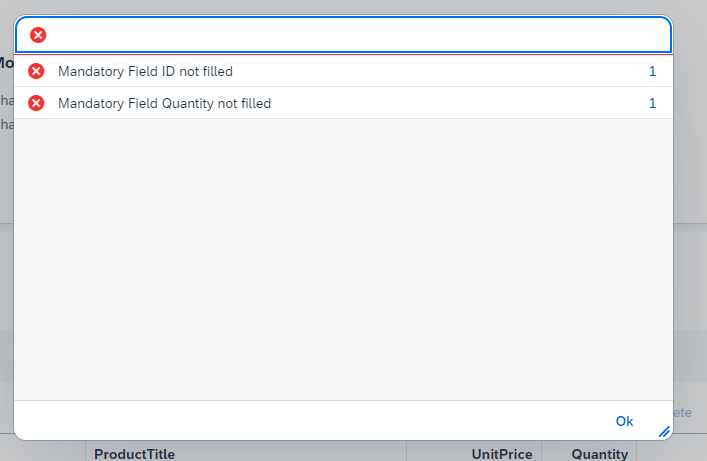

The following events can be used as extension points to intervene and manipulate data:

| Event | Description |
| ------ | --- |
| `checkBeforeRead` | Check data before data is uploaded to the UI5  |
| `changeBeforeCreate` | Change data before it is sent to the backend |
| `requestCompleted` | Event when the request is completed |
| `uploadButtonPress` | Fired when the `Upload` button is pressed, possible to prevent data send to backend |

## Check data before upload to app
When the file is uploaded to the App, the `checkBeforeRead` event is fired.

### Example
This sample is from the [sample app](https://github.com/marianfoo/ui5-cc-spreadsheetimporter/blob/47d22cdc42aa1cacfd797bdc0e025b830330dc5e/examples/packages/ordersv4fe/webapp/ext/ObjectPageExtController.js#L24-L42). 
It checks whether the price is over 100. 
````javascript
this.spreadsheetUpload.attachCheckBeforeRead(function(oEvent) {
    // example
    const sheetdata = oEvent.getParameter("sheetdata");
    let errorArray = [];
    for (const [index, row] of sheetdata.entries()) {
        //check for invalid price
        for (const key in row) {
            if (key.endsWith("[price]") && row[key].rawValue > 100) {
                const error = {
                    title: "Price too high (max 100)",
                    row: index + 2,
                    group: true,
                    rawValue: row[key].rawValue,
                    ui5type: "Error"
                };
                errorArray.push(error);
            }
        }
    }
    oEvent.getSource().addArrayToMessages(errorArray)
}, this)
````

You can add errors to the `messages` property of the `SpreadsheetUpload` control. After the event the upload is canceled and the errors are displayed in the error dialog.  
With the method `addArrayToMessages` you can add errors to the `messages` property. It expects an array of objects with the following properties:

- `title` - the title of the error
- `row` - the row number of the error
- `group` - if you want to group the errors, set `true` or `false`. (Grouping is by title)

The Errors with the same title will be grouped.

{ loading=lazy }

## Manipulate data before it is sent to the backend
When the `Upload` button is pressed, the `changeBeforeCreate` event is fired.

### Example
This sample is from the [sample app](https://github.com/marianfoo/ui5-cc-spreadsheetimporter/blob/47d22cdc42aa1cacfd797bdc0e025b830330dc5e/examples/packages/ordersv4fe/webapp/ext/ObjectPageExtController.js#L45-L52).
This is a sample to overwrite the payload.  

````javascript
this.spreadsheetUpload.attachChangeBeforeCreate(function (oEvent) {
    let payload = oEvent.getParameter("payload");
    // round number from 12,56 to 12,6
    if (payload.price) {
        payload.price = Number(payload.price).toFixed(1)
    }
    oEvent.getSource().setPayload(payload);
}, this);
````

## Event when the request is completed

When the request is completed, the `requestCompleted` event is fired.  
With the parameter `success` you can check if the request was successful.

### Example

```js
this.spreadsheetUpload.attachRequestCompleted(function (oEvent) {
    const success = oEvent.getParameter("success");
    if (success) {
        console.log("Request Completed");
    } else {
        console.log("Request Failed");
    }
}, this);
```

## Event when the upload button is pressed
When the `Upload` button is pressed, the `uploadButtonPress` event is fired. The event is fired before the `changeBeforeCreate` event.  
It is possible to prevent the data from being sent to the backend with the method `preventDefault` of the event.


### Example


````javascript
this.spreadsheetUpload.attachChangeBeforeCreate(function (oEvent) {
    // prevent data send to backend
    oEvent.preventDefault();
    // get payload
    const payload = oEvent.getParameter("payload")
}, this);
````