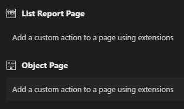
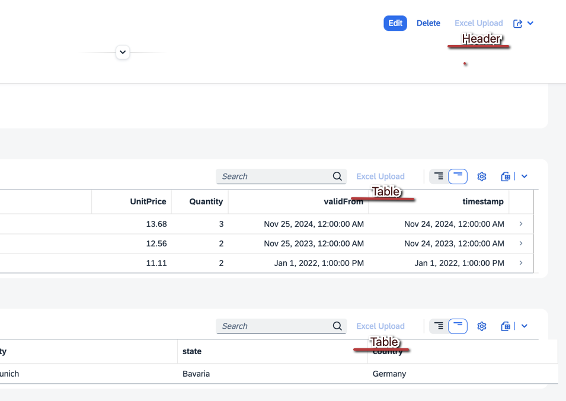

## Deployment Strategy

We recommend **centralized deployment** for this component, as the decentralized or packaged deployment has known issues when used with ABAP systems and SAP Business Technology Platform (BTP). Use decentralized deployment only if centralized deployment is not feasible.

For decentralized deployment in ABAP, see [ABAP Component Deployment](#component-deployment). For BTP deployment, special considerations are necessary, which are detailed in [BTP Deployment](#btp-deployment). A full BTP deployment example is available in this [sample project](https://github.com/spreadsheetimporter/sample-full-btp).

### Decentralized Deployment

!!! warning "Decentralized Deployment"
    This method is **not recommended**. Please use the [Central Deployment](CentralDeployment.md) instead.

In decentralized deployment, the component is included directly in each app and deployed with it. For ABAP-specific instructions, refer to [ABAP Component Deployment](#component-deployment).

### Central Deployment

In centralized deployment, the Spreadsheet Upload component is stored centrally, either in an on-premise ABAP system or in BTP. For detailed instructions, see the [Central Deployment](CentralDeployment.md) page.

## Setup

To integrate the `ui5-cc-spreadsheetimporter` component manually, follow the steps below. For a simplified setup, you can also use the [Yo generator](Generator.md).

### Requirements

- Node.js v16.18.0, v18.12.0 or higher
- npm v8.0.0 or higher
- UI5 CLI v3.0.0 or higher

### Setup for Decentralized Deployment

1\. **Install the component from npm:**

   ```sh
   npm install ui5-cc-spreadsheetimporter
   ```

2\. **Add `resourceRoots` to your `manifest.json` under `sap.ui5`:**

   !!! warning "Version Management"
       Ensure your `ui5-cc-spreadsheetimporter` version is up to date in your `manifest.json` whenever updating the module. For more information, see [Version Namespace](https://blogs.sap.com/2023/03/12/create-a-ui5-custom-library-with-versioning-using-a-multi-version-namespace/).

   ```json
   "resourceRoots": {
     "cc.spreadsheetimporter.v1_4_2": "./thirdparty/customcontrol/spreadsheetimporter/v1_4_2"
   }
   ```

3\. **Update your build script in `package.json` by adding `--all`:**

   ```json
   "scripts": {
     "build": "ui5 build --config=ui5.yaml --all --clean-dest --dest dist",
   }
   ```

4\. **Add `componentUsages` to your `manifest.json` under `sap.ui5`:**

   !!! warning "Version Management"
       Ensure your `ui5-cc-spreadsheetimporter` version is up to date in your `manifest.json` whenever updating the module. For more information, see [Version Namespace](https://blogs.sap.com/2023/03/12/create-a-ui5-custom-library-with-versioning-using-a-multi-version-namespace/).

   ```json
   "componentUsages": {
     "spreadsheetImporter": {
       "name": "cc.spreadsheetimporter.v1_4_2"
     }
   }
   ```

5\. **Optional: Handle the "component does not exist" error**

   If you encounter the `component does not exist` error when deploying to an SAP System (S/4 On-Premise or SAP BTP ABAP environment), add the following to your `manifest.json`:

   !!! warning "Resource Roots Path"
       Ensure the `resourceRoots` path is correct, especially the lowercase format change since version 0.34.0.

   ```json
   "sap.app": {
     "embeds": ["thirdparty/customcontrol/spreadsheetimporter/v1_4_2"]
   }
   ```

### Setup for Central Deployment

1\. **Deploy the component using your desired version.** Refer to [Central Deployment](CentralDeployment.md) for detailed instructions.

2\. **Add `componentUsages` to your `manifest.json` under `sap.ui5`:**

   !!! warning "Version Management"
       Ensure your `ui5-cc-spreadsheetimporter` version is up to date in your `manifest.json` whenever updating the module. For more information, see [Version Namespace](https://blogs.sap.com/2023/03/12/create-a-ui5-custom-library-with-versioning-using-a-multi-version-namespace/). Ensure the version is available in the system.

   ```json
   "componentUsages": {
     "spreadsheetImporter": {
       "name": "cc.spreadsheetimporter.v1_4_2"
     }
   }
   ```

## Starting with the Fiori Elements Application

!!! warning "OData Version Differences"
    There are different implementations for Fiori Elements depending on the OData version.

To start the Spreadsheet Upload Dialog, add a button in your Fiori Elements App. The [Guided Development](https://blogs.sap.com/2021/08/16/getting-up-to-speed-with-sap-fiori-tools-guided-development-overview/) extension is a recommended way to add a custom action:

{ loading=lazy }

After adding the custom action, implement your custom code either with [V2](#custom-code_1) or [V4](#custom-code). You can also use a controller extension in Fiori Elements. See the [Fiori Elements V4 Example App](https://github.com/spreadsheetimporter/ui5-cc-spreadsheetimporter/tree/main/examples/packages/ordersv4fe) for an example.

## Starting with Fiori Elements (OData V4)

### Manifest.json Extension

Here is an example of a custom action from the [sample app](https://github.com/spreadsheetimporter/ui5-cc-spreadsheetimporter/blob/main/examples/packages/ordersv4fe/webapp/manifest.json) for the object page. This example adds a button to the order items table on the object page. If there are multiple tables, always specify the relevant `tableId`. Use `"enabled": "{ui>/isEditable}"` to automatically disable the button when the page is not in edit mode.

```json
"OrdersObjectPage": {
  "type": "Component",
  "id": "OrdersObjectPage",
  "name": "sap.fe.templates.ObjectPage",
  "options": {
    "settings": {
      "editableHeaderContent": false,
      "entitySet": "Orders",
      "navigation": {
        "Items": {
          "detail": {
            "route": "Orders_ItemsObjectPage"
          }
        }
      },
      "controlConfiguration": {
        "Items/@com.sap.vocabularies.UI.v1.LineItem": {
          "actions": {
            "ObjectPageExtController": {
              "press": "ui.v4.ordersv4fe.ext.ObjectPageExtController.openSpreadsheetUploadDialogTable",
              "visible": true,
              "requiresSelection": false,
              "enabled": "{ui>/isEditable}",
              "text": "Spreadsheet Upload"
            }
          }
        }
      }
    }
  }
}
```

### Custom Code

The following code sets the busy indicator, creates the component if not already created, and opens the dialog. The `context` attribute is mandatory to allow the component to access the app's context, including binding paths and the model. You can pass options like `context` at runtime using the `openSpreadsheetUploadDialog` method. This is useful when opening the dialog for specific tables (see [TableSelector](TableSelector.md)).

```javascript
openSpreadsheetUploadDialog: async function (event) {
  this.getView().setBusyIndicatorDelay(0);
  this.getView().setBusy(true);
  this.spreadsheetUpload = await this.getView()
    .getController()
    .getAppComponent()
    .createComponent({
      usage: "spreadsheetImporter",
      async: true,
      componentData: {
        context: this,
      },
    });
  this.spreadsheetUpload.openSpreadsheetUploadDialog();
  this.getView().setBusy(false);
}
```

### Example

See the live demo at <https://livedemo.spreadsheet-importer.com/>.

{ loading=lazy }

## Starting with Fiori Elements (OData V2)

### Manifest.json Extension

Here is an example of a custom action from the [sample app](https://github.com/spreadsheetimporter/ui5-cc-spreadsheetimporter/blob/main/examples/packages/ordersv2fe/webapp/manifest.json) for the object page.

```json
"extends": {
  "extensions": {
    "sap.ui.controllerExtensions": {
      "sap.suite.ui.generic.template.ObjectPage.view.Details": {
        "controllerName": "ui.v2.ordersv2.ext.controller.ObjectPageExt",
        "sap.ui.generic.app": {
          "Orders": {
            "EntitySet": "Orders",
            "Sections": {
              "Items::com.sap.vocabularies.UI.v1.LineItem": {
                "id": "Items::com.sap.vocabularies.UI.v1.LineItem",
                "Actions": {
                  "spreadsheetImporter": {
                    "id": "spreadsheetUploadButton",
                    "text": "Spreadsheet Upload",
                    "applicablePath": "ui>/editable",
                    "press": "openSpreadsheetUploadDialog",
                    "requiresSelection": false
                  }
                }
              }
            }
          }
        }
      }
    }
  }
}
```

### Custom Code

```javascript


openSpreadsheetUploadDialog: async function (event) {
  this.getView().setBusyIndicatorDelay(0);
  this.getView().setBusy(true);
  this.spreadsheetUpload = await this.getView()
    .getController()
    .getOwnerComponent()
    .createComponent({
      usage: "spreadsheetImporter",
      async: true,
      componentData: {
        context: this,
      },
    });
  this.spreadsheetUpload.openSpreadsheetUploadDialog();
  this.getView().setBusy(false);
}
```

## Deployment of Your App

### ABAP Stack

#### Component Deployment

These instructions apply generally to UI5 Reuse Components, not just the Spreadsheet Importer (see [UI5 Reuse Components](https://sapui5.hana.ondemand.com/sdk/#/topic/6314fcd2510648fbaad3cee8a421030d.html)).

When deploying the component decentrally to an ABAP system, its namespace is registered in the app index, the same as with central deployment. After deploying decentrally for the first time, you can use the component centrally (see [Setup Central Deployment](#setup-central-deployment)). However, you can only deploy the component decentrally once because the namespace can only exist once in the app index.

This is why we recommend starting with central deployment.

#### Using the Component Outside the App Index

If the component is used outside the Fiori Launchpad, or if it cannot be found even after deployment, you can direct the app to the correct path using `url` and `name` in the `createComponent` method:

```javascript
openSpreadsheetUploadDialog: async function (oEvent) {
  this.getView().setBusyIndicatorDelay(0);
  this.getView().setBusy(true);
  this.spreadsheetUpload = await this.getView()
    .getController()
    .getAppComponent()
    .createComponent({
      usage: "spreadsheetImporter",
      async: true,
      componentData: {
        context: this,
      },
      url: "/sap/bc/ui5_ui5/sap/Z_XUP_v0_33_2",
      name: "cc.spreadsheetimporter.v1_4_2"
    });
  this.spreadsheetUpload.openSpreadsheetUploadDialog();
  this.getView().setBusy(false);
}
```

This method can be used as an alternative to `resourceRoots` in the `manifest.json` when you do not have access to the `manifest.json` (e.g., in adaptation projects).

#### Error: Library/Component Used in Application Does Not Exist

When deploying the app to your ABAP system, you might encounter an error like `SAPUI5 library/component cc.spreadsheetimporter.v1_4_2 used in application Z*** does not exist`. The application is deployed, but the service returns an error.

To avoid this error, add the following to your `manifest.json` file:

!!! warning "Resource Roots Path"
    Ensure the `resourceRoots` path is correct, especially the lowercase format change since version 0.34.0.

```json
"sap.app": {
  "embeds": ["thirdparty/customcontrol/spreadsheetimporter/v1_4_2"]
}
```

This addition should resolve the issue, making `resourceRoots` unnecessary.

#### File Unknown When Deploying the App

If the ABAP system does not recognize `.ts` files, create a `.Ui5RepositoryTextFiles` file in your app's `webapp` folder, as described [here](https://ui5.sap.com/#/topic/a883327a82ef4cc792f3c1e7b7a48de8). An example file is available [here](https://github.com/spreadsheetimporter/packed-deployment-abap/blob/main/webapp/.Ui5RepositoryTextFiles) and might look like this:

```txt
^.*.ts$
^.*.ts.map$
^.*.js.map$
```

If you use the `deploy-to-abap` command, you can exclude these files from the deployment by adding the `exclude` option to your `ui5.yaml` file:

```yaml
customTasks:
  - name: deploy-to-abap
    afterTask: replaceVersion
    configuration:
      target:
        url: https://XYZ.sap-system.corp:44311
        client: 200
        auth: basic
      credentials:
        username: env:XYZ_USER
        password: env:XYZ_PASSWORD
      app:
        name: /TEST/SAMPLE_APP
        package: /TEST/UPLOAD
        transport: XYZQ300582
      exclude:
      - .*\.ts
      - .*\.ts.map
      - .*\.js.map
```

### BTP Environment

#### Running with CAP

If you are using CAP and installing the component as a dependency **to your UI5 App**, you need to use [`cds-plugin-ui5`](https://www.npmjs.com/package/cds-plugin-ui5?activeTab=versions) to ensure the UI5 Tooling loads the installed component.

```sh
npm install cds-plugin-ui5 --save-dev
```

#### Configuring `ui5-task-zipper` in Your Deployment YAML File

A full example can be found in this [sample project](https://github.com/spreadsheetimporter/sample-full-btp/blob/main/app/mitigations/ui5-deploy.yaml).

If you use the `ui5-task-zipper` task, ensure that `ui5-cc-spreadsheetimporter` is included in the zip file.

```yaml
builder:
  customTasks:
    - name: ui5-task-zipper
      afterTask: generateComponentPreload
      configuration:
        archiveName: uimodule
        includeDependencies:
        - ui5-cc-spreadsheetimporter-v1-4-2
```

The metadata name is defined in the [`ui5.yaml`](https://github.com/spreadsheetimporter/ui5-cc-spreadsheetimporter/blob/9b61a778e5b0a5b66c15f5889334a6d684ae88de/packages/ui5-cc-spreadsheetimporter/ui5.yaml#L4) file of the component.

!!! warning "Metadata Name"
    Before version 0.34.0, the metadata name was `ui5-cc-spreadsheetimporter` without the version.

#### Updating `"sap.cloud".service` in Spreadsheet Importer `manifest.json`

When using decentralized deployment, deployment may fail with the following error:

`"Service name 'spreadsheetimporter_v1_4_2' and public setting 'true' in embedded manifest.json have to be equal to service name 'xxxxxxx' and public setting 'true' of root manifest.json"`

SAP currently does not provide a fix for this. 

##### Workaround 1

Manually update the `service` name in the `manifest.json` of the Spreadsheet Importer to match the service name in your app's `manifest.json`.

To automate this, you can use the custom UI5 Tooling task [`ui5-task-btp-manifest`](https://github.com/spreadsheetimporter/ui5-task-btp-manifest).

###### Install the Task

```bash
npm install --save-dev ui5-task-btp-manifest
```

###### Add the Task to Your `ui5.yaml`

```yaml
builder:
  customTasks:
    - name: ui5-task-btp-manifest
      afterTask: replaceVersion
```

This task will update the Spreadsheet Importer manifest with the app's service name at this path: `dist/thirdparty/customcontrol/spreadsheetimporter/v1_4_2/manifest.json`.

##### Workaround 2

According to a [comment from user TravelTechCode](https://github.com/spreadsheetimporter/ui5-cc-spreadsheetimporter/issues/582#issuecomment-2210564980), you can try the following deployment sequence:

1. Deploy your app without the UI5 Spreadsheet component first.
2. Add the UI5 Spreadsheet component and deploy the app again.

This approach avoids deployment errors and allows the component to be accessed in the content explorer.