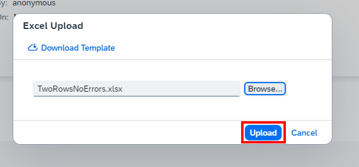

# User Documentation

This User Documentation provides a brief overview of the Fiori Element Object Page scenario and uploading Order Items.

1\. Open the Spreadsheet Upload Dialog

{ loading=lazy }

2\. Download the Template

To ensure a smooth process without errors, it is recommended to always download a new template. However, if you are confident that the data structure has not changed, you may use a previously downloaded template.

{ loading=lazy }

3\. Fill out the template

Now, fill the template with the necessary data and save the file.

{ loading=lazy }

4\. Upload File to Application

Click on the "Browse" button to upload the file.
If the upload is successful, a message will appear saying "Upload Successful."

{ loading=lazy }

5\. Error Dialog

During the upload process, various checks are performed in the background. If any errors are encountered, such as unfilled mandatory fields, they will be displayed in the error dialog.

{ loading=lazy }

6\. Send Data to Backend

If no errors appear, click the "Upload" button to send the data to the backend.

{ loading=lazy }