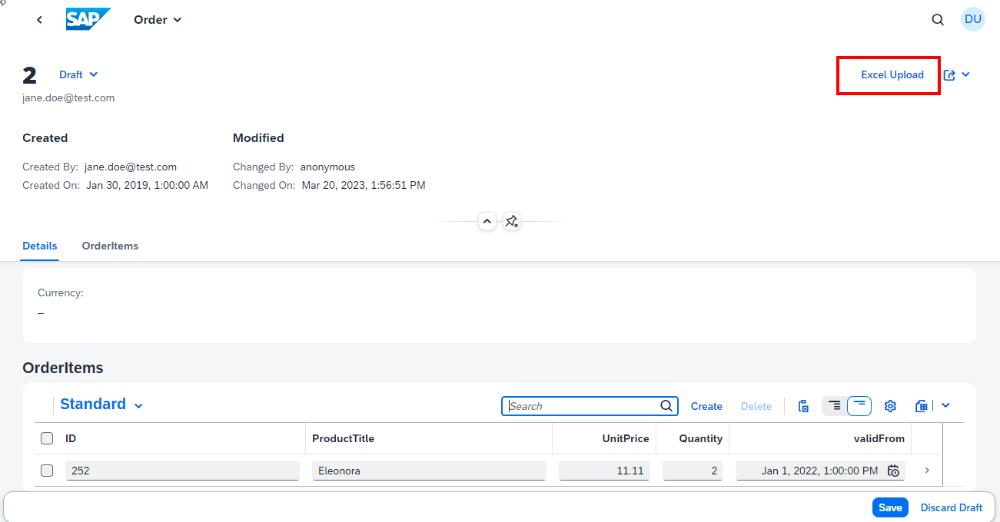
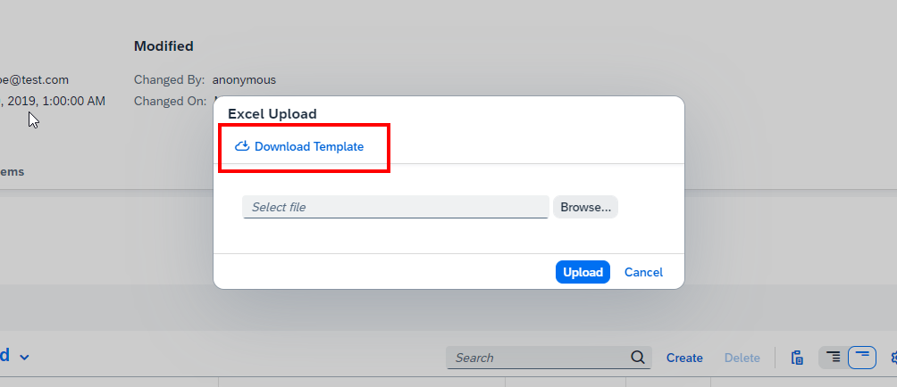
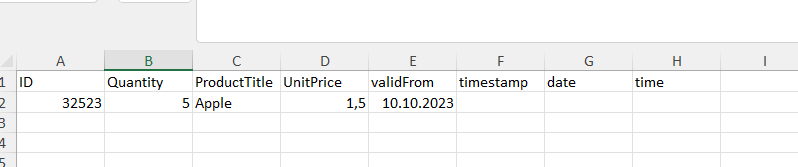
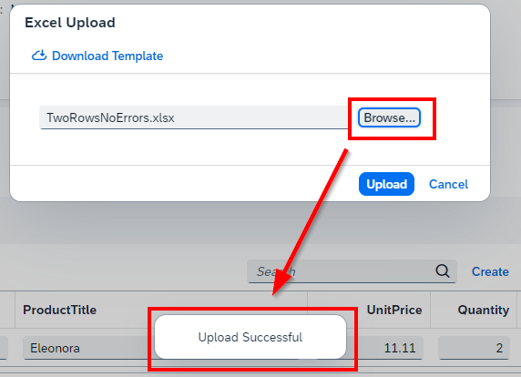
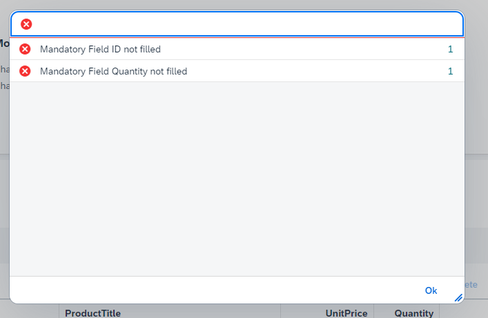
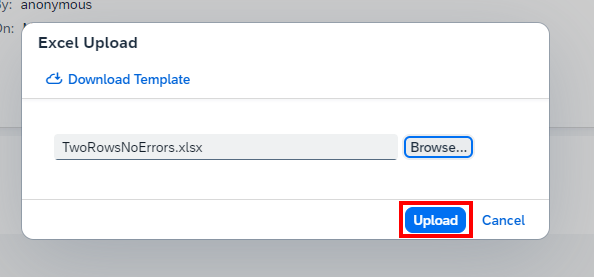

# User Documentation

This User Documentation provides a brief overview of the Fiori Element Object Page scenario and uploading Order Items.

1\. Open the Spreadsheet Upload Dialog

{ loading=lazy }

2\. Download the Template

To ensure a smooth process without errors, it is recommended to always download a new template. However, if you are confident that the data structure has not changed, you may use a previously downloaded template.

{ loading=lazy }

3\. Fill out the template

Now, fill the template with the necessary data and save the file.

!!! tip "Working with NULL and Empty Values"
The Spreadsheet Importer supports precise control over null and empty values:

    - **Empty cell**: Field is not changed (UPDATE) or uses backend default (CREATE)
    - **Type `__NULL__`**: Explicitly set field to NULL (cleared value)
    - **Type `__EMPTY__`**: Set string field to empty string (not NULL)

    For comprehensive guide with examples, see [Null & Empty Value Handling](NullHandling.md).

{ loading=lazy }

4\. Upload File to Application

You have multiple ways to provide your spreadsheet data:

**Option A: Upload File**
Click on the "Browse" button to upload the file.

**Option B: Drag & Drop**
Simply drag your spreadsheet file directly onto the upload area.

**Option C: Paste Data** ✨ _Available since v2.3.0_

- Copy spreadsheet data from Excel/Google Sheets (Ctrl+C)
- Paste directly into the upload dialog (Ctrl+V)
- Or paste an entire .xlsx file that you've copied from your file system

If the upload is successful, a message will appear saying "Upload Successful."

{ loading=lazy }

5\. Error Dialog

During the upload process, various checks are performed in the background. If any errors are encountered, such as unfilled mandatory fields, they will be displayed in the error dialog.

{ loading=lazy }

6\. Send Data to Backend

If no errors appear, click the "Upload" button to send the data to the backend.

{ loading=lazy }
