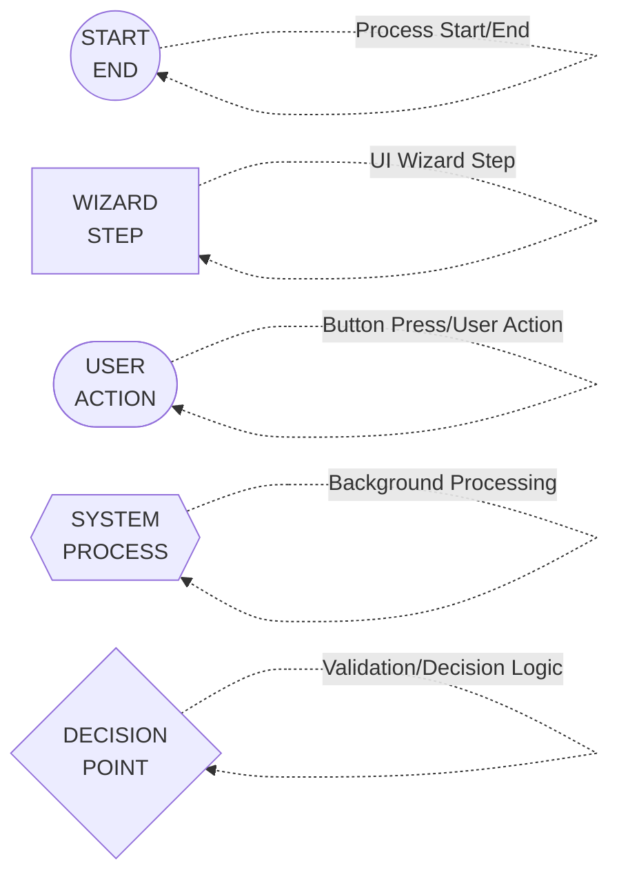
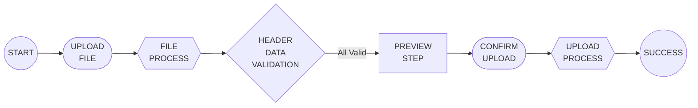
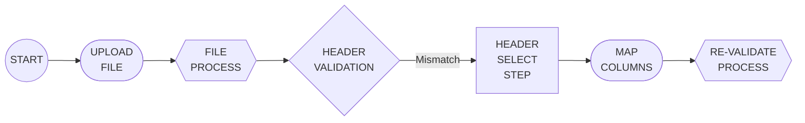
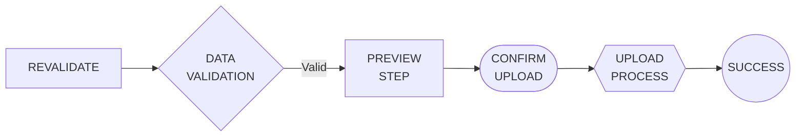
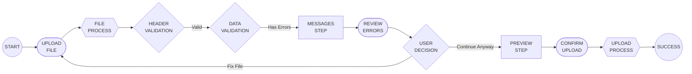
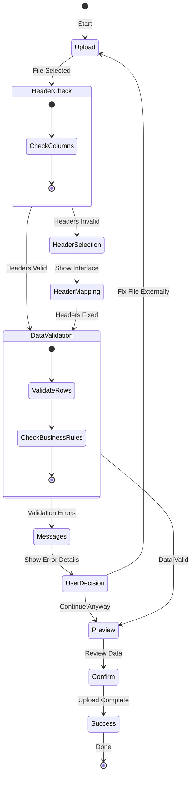

The Wizard Dialog provides a guided, step-by-step interface for importing Spreadsheet files into your UI5 application. It offers enhanced user experience with automatic step progression, header validation, error handling, and data preview capabilities.

## Overview

<!-- prettier-ignore-start -->
!!! warning "This feature is available since Spreadsheet Importer version 2.2.0"
<!-- prettier-ignore-end -->

<!-- prettier-ignore-start -->
!!! warning "Not usable in UI5 versions below 1.84"
    The `sap.m.Wizard` used here is using the `Page` render mode, which is not available in UI5 versions below 1.84.
<!-- prettier-ignore-end -->

The wizard is a alternative to the single-dialog approach with a multi-step guided process that guides users through each import step with clear instructions.  
A new feature compared to the single-dialog approach is the ability to select the correct line where the data is located in the spreadsheet in the wizard process.
More features are planned for the future.

## Wizard Steps

### 1. Upload File Step

- **Purpose**: Select and upload Spreadsheet file
- **Features**: Drag & drop support, file validation

### 2. Header Selection Step (Conditional)

- **Purpose**: Map/fix column headers when header issues are detected
- **When shown**: Only appears when automatic header validation fails
- **Features**: Interactive table for header row selection, real-time validation

### 3. Messages Step (Conditional)

- **Purpose**: Review and handle validation messages
- **When shown**: When validation errors exist (but headers are valid)
- **Features**: Categorized error display, continue anyway option, error download

### 4. Preview Data Step

- **Purpose**: Review data before final import
- **Features**: Data table preview, final import confirmation

## Getting Started

### 1. Enable Wizard Mode

To use the wizard instead of the traditional dialog, set the `useImportWizard` property to `true`:

```xml
<core:ComponentContainer
  id="wizardSpreadsheetImporter"
  width="100%"
  usage="spreadsheetImporter"
  propagateModel="true"
  async="true"
  settings="{
        useImportWizard: true,
        debug: true,
        createActiveEntity: true
    }"
/>
```

### 2. Configuration Options

The wizard supports all standard spreadsheet importer [configuration options](Configuration.md), plus:

| Option            | Type      | Default | Description                                  |
| ----------------- | --------- | ------- | -------------------------------------------- |
| `useImportWizard` | `boolean` | `false` | Enables wizard mode instead of single dialog |

## Using the Wizard Programmatically

### openWizard() Method

You can open the wizard programmatically using the `openWizard()` method:

```javascript
/**
 * Opens the wizard programmatically
 */
openWizard: async function () {
      this.spreadsheetUpload = await this.getView()
     .getController()
     .getOwnerComponent()
     .createComponent({
      usage: "spreadsheetImporter",
      async: true,
      componentData: {
       context: this,
              useImportWizard: true
      }
     });
    this.spreadsheetUpload.openWizard();
}
```

### openWizard() with Options

You can pass configuration options to override component settings:

```javascript
openWizard: function () {
          this.spreadsheetUpload = await this.getView()
     .getController()
     .getOwnerComponent()
     .createComponent({
      usage: "spreadsheetImporter",
      async: true,
      componentData: {
       context: this,
      useImportWizard: true
      }
     });

    // Configuration options to override component settings
    const wizardOptions = {
        strict: true,                    // Enable strict mode
        batchSize: 500,                 // Override batch size
        mandatoryFields: ["ID", "Name"], // Set mandatory fields
        columns: ["ID", "Name", "Email"], // Limit columns
        debug: true                      // Enable debug mode
    };

    oComponent.openWizard(wizardOptions)
}
```

## Events and Error Handling

The wizard supports all standard [events](Events.md):

```javascript
// Attach events before opening wizard
oComponent.attachUploadButtonPress(function (event) {
  // Handle upload completion
  const payload = event.getParameter('payload');
  console.log('Data uploaded:', payload);
});

oComponent.attachCheckBeforeRead(function (event) {
  // Validate data before processing
  const sheetData = event.getParameter('sheetData');
  // Add custom validation logic
});
```

## Best Practices

### 1. Error Handling

- Always handle the promise returned by `openWizard()`
- Provide user feedback for both success and error cases
- Use appropriate error messages for different scenarios

### 2. Configuration

- Use `debug: true` during development for detailed logging
- Set appropriate `batchSize` for your data volume
- Configure `mandatoryFields` for data validation

### 3. User Experience

- Provide clear instructions about expected data format
- Use the template download feature for users
- Consider using `strict: false` to allow users to continue with warnings

### 4. Performance

- Use `continueOnError: true` for large datasets
- Consider `createActiveEntity: true` for better performance in draft scenarios
- Optimize `batchSize` based on your backend capabilities

## Migration from Classic Dialog

To migrate from the classic dialog to the wizard:

1. **Add the wizard flag**:

   ```xml
   settings="{
       useImportWizard: true,
       // ... other existing settings
   }"
   ```

2. **Update method calls** (optional):

   ```javascript
   // Old way
   oComponent.openSpreadsheetUploadDialog(options);

   // New way (both work)
   oComponent.openWizard(options);
   ```

3. **Test the new flow**: The wizard provides better error handling and user guidance while maintaining compatibility with existing configurations.

## Troubleshooting

### Common Issues

1. **Wizard doesn't open**

   - Ensure `useImportWizard: true` is set
   - Check component initialization
   - Verify component instance is available

2. **Steps not progressing**

   - Check browser console for validation errors
   - Verify file format is supported
   - Ensure headers match expected format

3. **Options not applied**
   - Verify options object format
   - Check for typos in option names
   - Use browser developer tools to inspect settings

For more troubleshooting information, see [Troubleshooting](Troubleshooting.md).

## Wizard Flow

The wizard intelligently adapts its flow based on the data quality and validation results. Here are the main user journey scenarios:

### Flow Element Legend



### :material-check-circle: 1. Happy Path (No Issues)

<!-- prettier-ignore-start -->
!!! success "Ideal Scenario"
    When your file has perfect data with no validation issues, the wizard provides the fastest path to upload.
<!-- prettier-ignore-end -->



**Flow Details:**

1. **Start** - User initiates wizard
2. **Upload File** - User selects or drops file
3. **File Processing** - System processes uploaded file
4. **Validation** - Automatic header & data validation
5. **Preview Step** - Auto-advance to preview wizard step
6. **Confirm Upload** - User presses confirm button
7. **Upload Process** - System uploads data to backend
8. **Success** - Upload completed successfully

---

### :material-table-edit: 2. Header Issues Path

<!-- prettier-ignore-start -->
!!! warning "Header Mismatch"
    When column headers don't match the expected format, the wizard guides users through mapping.
<!-- prettier-ignore-end -->





**Flow Details:**

1. **Start** - User initiates wizard
2. **Upload File** - User selects file
3. **File Processing** - System processes file
4. **Header Validation** - Column mapping validation
5. **Header Selection Step** - Wizard shows header mapping step
6. **Map Columns** - User corrects column assignments
7. **Re-validation** - System re-validates with new mapping
8. **Data Validation** - Verify data quality
9. **Preview Step** - Review mapped data
10. **Confirm Upload** - User confirms final upload
11. **Upload Process** - System processes upload
12. **Success** - Upload completed

---

### :material-alert-circle: 3. Validation Errors Path

<!-- prettier-ignore-start -->
!!! info "Data Quality Issues"
    When data has validation errors but headers are correct, users can review and decide how to proceed.
<!-- prettier-ignore-end -->



**Flow Details:**

1. **Start** - User initiates wizard
2. **Upload File** - User selects file
3. **File Processing** - System processes file
4. **Header Validation** - Column mapping successful
5. **Data Validation** - System finds data issues
6. **Messages Step** - Wizard shows messages step
7. **Review Errors** - User reviews detailed error messages
8. **User Decision** - User chooses to proceed or fix
9. **Preview Step** - Review data with errors highlighted
10. **Confirm Upload** - User confirms upload with warnings
11. **Upload Process** - System processes upload
12. **Success** - Upload completed with warnings

## Wizard State Machine

The wizard follows a state machine pattern that intelligently routes users based on validation results:


